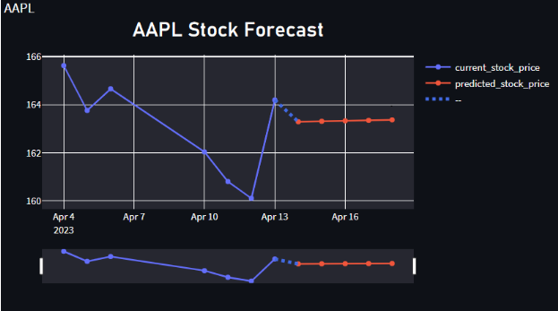

# Stock-Price-Prediction

## Introduction
This project is to predict the stock price of a company using the historical data of the company. The historical data is obtained from Yahoo Finance. The data is preprocessed and then fed into the model. The model is trained using the data and then the model is used to predict the stock price of the company.

## Demo
The demo of the project is available at [Stock Price Prediction](https://jay4codes-stonk-prediction-main-exreo5.streamlit.app/).

The app might take a few minutes to get started the first time due to inactivity.

## Data
The data is obtained from Yahoo Finance. The data is downloaded in the form of csv file. The data is then preprocessed and then fed into the model.

## Model
The model is a sequential model using LSTM layers. The model is trained using the data. The model is then used to predict the stock price of the company.

## Result
The predicted stock price using the model is shown in the figure below.

